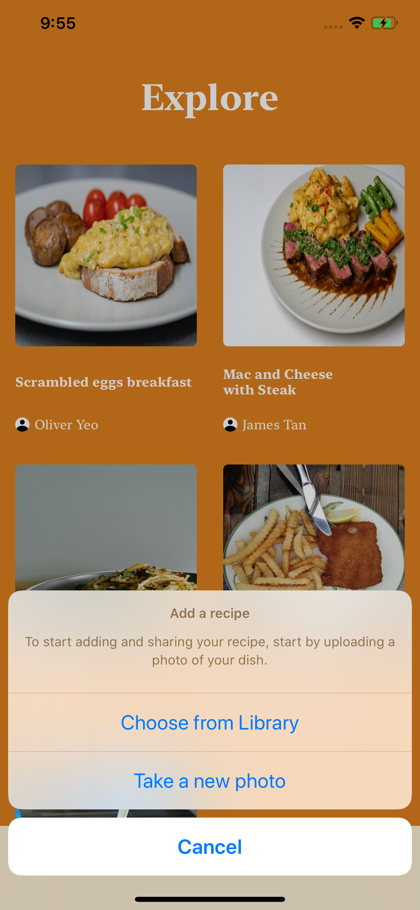
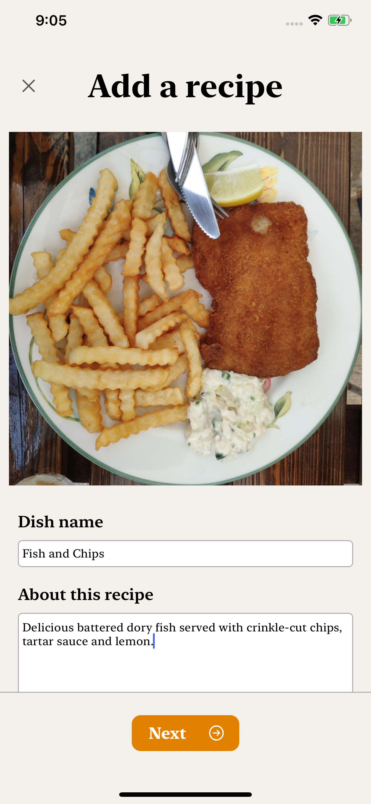
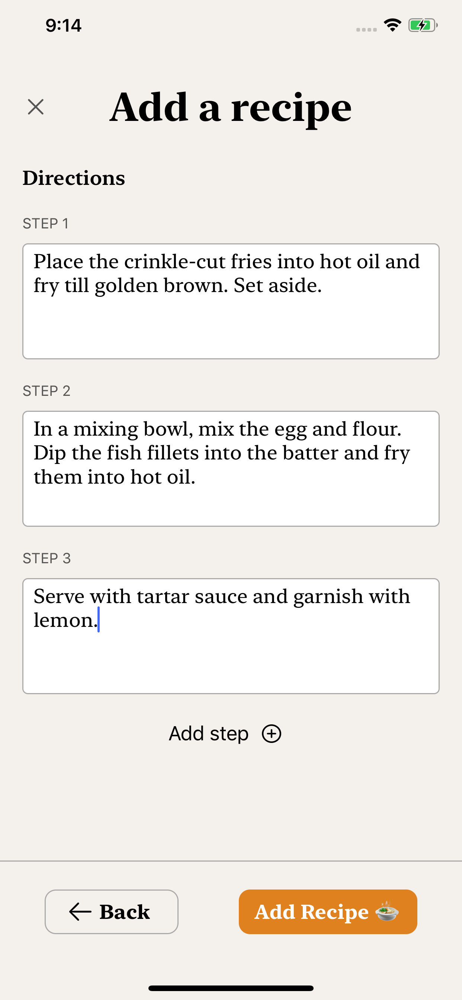
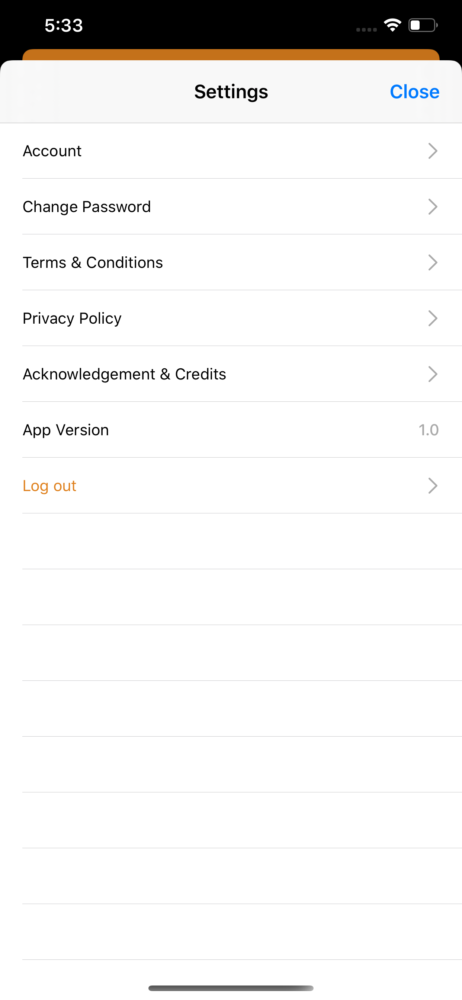
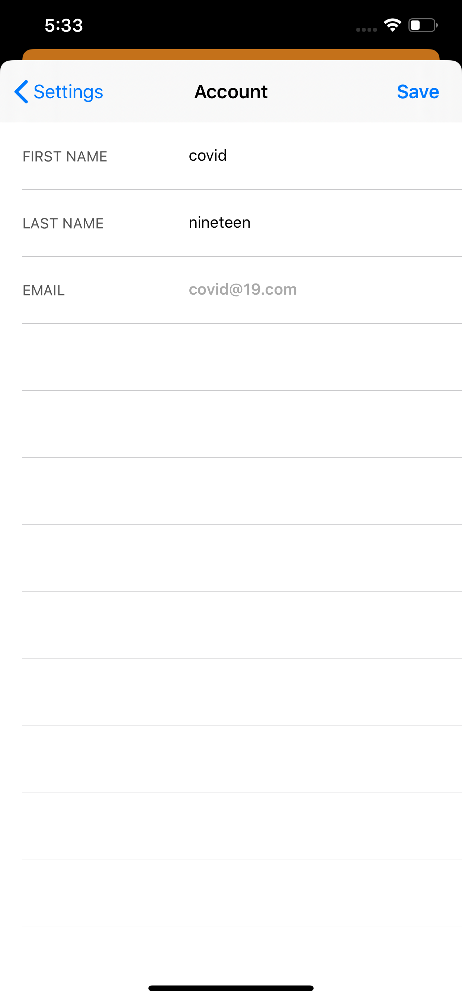
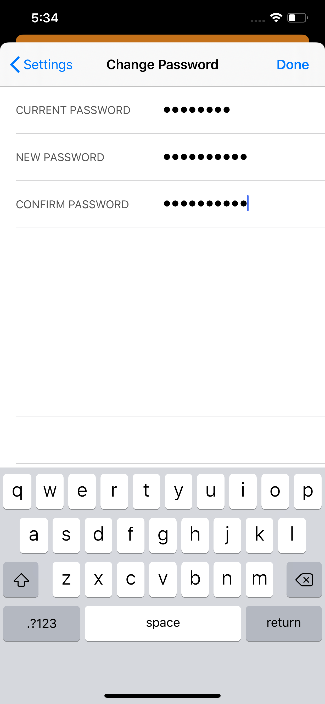

# shiokrecipes - An iOS recipe sharing app

## Introduction

shiokrecipes is an iOS application which allows food lovers to browse and share recipes. During the [circuit breaker](https://en.wikipedia.org/wiki/2020_Singapore_circuit_breaker_measures) period in Singapore, one of the things I tried to do at home was to improve my cooking skills. From this, I got inspired to attempt to design and develop a recipe sharing app. This project also showcases my skills in iOS development I have honed over the past year and a half. As this is still a work in progress, this readme will contain the current features of this project as well as the upcoming features I plan to implement.

## Tech Stack

Frontend - Developed with Swift and Xcode. Views were created both using interface builder and via code.
Backend - Implemented using Firebase.
Design Pattern - MVC

## Current Features

### Authentication

Authentication which includes logging in, signing up, resetting/changing of password, was done using Firebase.

### Uploading of recipe to Firestore

To upload a recipe, a user would start by taking a picture of the dish, thereafter specifying more details such as the prep/cook time, ingredients and directions. The recipe details are being uploaded to Firestore and the recipe image uploaded to Firebase Storage.

### Account Settings

This is where a user would be able to update their first & last name, view the terms & conditions, privacy policy, and log out from the app.

// Add screenshots of account settings here

## Upcoming Features

### Recipe details screen

In Recipe details screen, a user would be able to go through a recipe, and check off ingredients or directions, depending on where they are in the cooking process. This screen can be accessed from the 'Explore', 'My Recipes', or 'Favorites' screen.

### My Recipe

A paginated UICollectionView in which users can view all of their uploaded recipes

### Favorites

Soon, a user would be able to add a recipe to their list of favorites, allowing for easy access to their favorite recipes.
